# 🌊 x402Solana - AI-Powered Payments for the Autonomous Web

<div align="center">


**Experience real on-chain payments, autonomous agents, and decentralized commerce - all powered by Solana, x402, MCP tools, and the Vercel AI SDK (OpenAI).**

[Features](#-features) • [Quick Start](#-quick-start) • [Documentation](#-documentation) • [Architecture](#-architecture) • [Contributing](#-contributing)

</div>
---

## Table of Contents

- [Overview](#overview)
- [Features](#features)
- [Tech Stack](#tech-stack)
- [Architecture](#architecture)
- [Quick Start](#quick-start)
- [Commands & Usage](#commands--usage)
- [API Reference](#api-reference)
- [SDK Usage](#sdk-usage)
- [Examples](#examples)
- [Development](#development)
- [Deployment](#deployment)
- [Contributing](#contributing)
- [License](#license)

---
##click to watch the demo video 
[](https://youtu.be/FMATquoDmS4)

## Overview

**x402Solana** is a complete platform for AI-powered payments on Solana using the x402 payment protocol, the Vercel AI SDK (OpenAI), and autonomous agents. The platform enables AI agents to request, verify, and execute cryptocurrency payments in real-time - facilitating true agent-to-agent commerce.

### Key Capabilities

- **Autonomous Agents**: Build AI agents that can transact, charge, and verify payments automatically
- **x402 Protocol**: Machine-verifiable payment requests designed for AI ↔ AI commerce
- **Solana Integration**: Fast, cheap transactions with USDC SPL token support
- **AI Agent Integration**: Vercel AI SDK + OpenAI backing the chat agent
- **Telegram Bot**: Deploy agents directly into Telegram conversations
- **Developer SDK**: JavaScript/TypeScript SDK for easy integration

---

## Features

### Core Features

- **Landing Page**: Complete marketing site with hero, features, live demo, and documentation
- **x402 Payment Protocol**: Invoice creation, payment requests, and verification
- **Solana Integration**: Transaction creation, signing, and on-chain verification
- **AI Agent Integration**: Client and merchant agent templates with chat UI (OpenAI via Vercel AI SDK)
- **Authentication**: NextAuth.js with email/password
- **User Dashboards**: Profile, API keys, and wallet management
- **Merchant Dashboard**: Settings, invoices, and transaction management
- **Telegram Bot**: Webhook handler for Telegram integration
- **SDK**: JavaScript/TypeScript SDK for easy integration
- **Documentation**: Complete docs with quickstart guides
- **Observability**: Logging, metrics, and audit trails

### Advanced Features

- **Security**: Noncustodial wallet signing, anti-replay protection, invoice expiry
- **Analytics**: Payment metrics, success rates, confirmation times
- **Webhooks**: Real-time notifications for payment events
- **Modern UI**: Glassmorphism design with Three.js particle effects
- **Responsive**: Mobile-first design with adaptive layouts
- **Dark Theme**: Beautiful blue-themed dark mode

---

## Devnet Helpers (Wallet + Airdrop)

Quick scripts to get a funded devnet wallet for testing:

```bash
# Generate a new Solana keypair (prints public + secret; keep secret safe)
pnpm keygen:solana

# Airdrop SOL on devnet (customize address/amount/rpc)
pnpm airdrop:solana --address <YOUR_DEVNET_PUBLIC_KEY> --amount 1 --rpc https://api.devnet.solana.com
```

Environment hints for devnet testing:
- `NEXT_PUBLIC_SOLANA_NETWORK=devnet`
- `NEXT_PUBLIC_SOLANA_RPC_URL=https://api.devnet.solana.com`
- `NEXT_PUBLIC_MERCHANT_ADDRESS=<your devnet wallet>`
- `NEXT_PUBLIC_PAYMENT_TOKEN=SOL` (or set a devnet USDC mint via `NEXT_PUBLIC_PAYMENT_TOKEN`/`NEXT_PUBLIC_USDC_MINT`)
- `NEXT_PUBLIC_PAYMENT_AMOUNT=0.1`
- `OPENAI_API_KEY=<your key>` for the chat agent

After funding, connect your wallet in the chat page, ask to “buy …”, and use the PayWithWallet prompt to run an on-chain transaction.

---

## npm SDK

The TypeScript SDK that powers agent-to-agent payments is published as [`@fozagtx/x402-sdk`](https://www.npmjs.com/package/@fozagtx/x402-sdk). Use it to invoice agents, build Solana transactions, tap Phantom/Solflare wallets, and integrate x402 flows inside your own apps.

```bash
npm install @fozagtx/x402-sdk @solana/web3.js
# or
pnpm add @fozagtx/x402-sdk @solana/web3.js
```

- Full TypeScript typings with Node + browser parity
- Wallet-agnostic signer abstraction plus auto-detection helpers
- Invoice helpers (`createInvoice`, `watchInvoice`) with retry/backoff + structured `X402Error` hooks
- Example scripts: devnet Node flow + browser wallet demo in `sdk/examples/`

## Tech Stack

### Frontend


### Blockchain & Web3


### Backend


### Tools & Libraries


### Development


---

## Architecture

```mermaid
graph TB
    subgraph "Frontend Layer"
        A[Next.js App] --> B[React Components]
        B --> C[Wallet Provider]
        B --> D[Chat UI]
        B --> E[Payment Flows]
    end

    subgraph "Agent Layer"
        F[Client Agent] --> G[AI SDK Client]
        H[Merchant Agent] --> G
        G --> I[x402 Tools]
        G --> J[Payment Tools]
    end

    subgraph "API Layer"
        K[Next.js API Routes] --> L[Invoice API]
        K --> M[Auth API]
        K --> N[MCP Router]
        K --> O[Telegram Webhook]
    end

    subgraph "Business Logic"
        L --> P[x402 Service]
        P --> Q[Invoice Manager]
        P --> R[Payment Verifier]
        N --> S[MCP Services]
        S --> T[Merchant Service]
        S --> U[Payment Service]
    end

    subgraph "Blockchain Layer"
        V[Solana RPC] --> W[Transaction Builder]
        W --> X[Wallet Signer]
        X --> Y[Solana Network]
        R --> Y
    end

    subgraph "Data Layer"
        Z[Prisma ORM] --> AA[(SQLite Database)]
        AA --> AB[Users]
        AA --> AC[Merchants]
        AA --> AD[Invoices]
        AA --> AE[Sessions]
    end

    subgraph "External Services"
        AF[AI SDK + OpenAI] --> G
        AG[Telegram Bot] --> O
        AH[Webhooks] --> T
    end

    A --> K
    F --> K
    H --> K
    C --> X
    E --> W
    K --> Z
    Q --> AA
    R --> V
    T --> AH
    O --> AG
    G --> AF

    style A fill:#0a1628,stroke:#3b82f6,stroke-width:2px
    style G fill:#14F195,stroke:#9945FF,stroke-width:2px
    style P fill:#FF6B6B,stroke:#4ECDC4,stroke-width:2px
    style Y fill:#9945FF,stroke:#14F195,stroke-width:2px
    style AA fill:#2D3748,stroke:#48BB78,stroke-width:2px
```



### Component Flow


---

## Quick Start

### Prerequisites

- **Node.js** 18+ ([Download](https://nodejs.org/))
- **pnpm** ([Install](https://pnpm.io/installation))
- **Git** ([Download](https://git-scm.com/))
- **Solana CLI** (optional, for devnet testing)

### Installation

1. **Clone the repository**

```bash
git clone https://github.com/fozagtx/x402solana.git
cd x402solana
```

2. **Install dependencies**

```bash
pnpm install
```

3. **Set up environment variables**

Create a `.env` file in the root directory:

```env
# Database
DATABASE_URL="file:./prisma/dev.db"

# NextAuth
NEXTAUTH_URL="http://localhost:3000"
NEXTAUTH_SECRET="your-secret-key-change-in-production"

# Solana
SOLANA_CLUSTER="devnet"
SOLANA_RPC_URL="https://api.devnet.solana.com"

```

4. **Set up the database**

```bash
# Generate Prisma client
pnpm prisma generate

# Run migrations
pnpm prisma migrate dev

# (Optional) Open Prisma Studio
pnpm prisma studio
```

5. **Start the development server**

```bash
pnpm dev
```

The application will be available at `http://localhost:3000`

---

## Commands & Usage

### Development Commands

```bash
# Start development server
pnpm dev

# Build for production
pnpm build

# Start production server
pnpm start

# Run linter
pnpm lint

# Type check
pnpm type-check
```

### Database Commands

```bash
# Generate Prisma client
pnpm prisma generate

# Create new migration
pnpm prisma migrate dev --name migration_name

# Reset database (⚠️ deletes all data)
pnpm prisma migrate reset

# Open Prisma Studio (database GUI)
pnpm prisma studio

# Format Prisma schema
pnpm prisma format

# Validate Prisma schema
pnpm prisma validate
```

### Testing Commands

```bash
# Run tests (if configured)
pnpm test

# Run tests in watch mode
pnpm test:watch

# Run tests with coverage
pnpm test:coverage
```

### Build & Deployment

```bash
# Build for production
pnpm build

# Start production server
pnpm start

# Analyze bundle size
pnpm analyze
```

---

## API Reference

### Invoice Management

#### Create Invoice

```http
POST /api/v1/invoices
Content-Type: application/json

{
  "merchantId": "merchant-123",
  "amount": "1.0",
  "token": "USDC",
  "metadata": {
    "item": "Digital Product",
    "description": "Premium access"
  }
}
```

**Response:**

```json
{
  "id": "invoice-123",
  "merchantId": "merchant-123",
  "amount": "1.0",
  "token": "USDC",
  "status": "pending",
  "expiresAt": "2024-01-01T12:00:00Z",
  "nonce": "abc123...",
  "createdAt": "2024-01-01T11:00:00Z"
}
```

#### Get Invoice

```http
GET /api/v1/invoices/:id
```

#### List Invoices

```http
GET /api/v1/invoices?merchantId=merchant-123&status=pending&limit=10&offset=0
```

#### Update Invoice Status

```http
POST /api/v1/invoices/:id
Content-Type: application/json

{
  "txSignature": "5j7s8...",
  "status": "paid"
}
```

### Webhook Management

#### Register Webhook

```http
POST /api/v1/webhooks/register
Content-Type: application/json

{
  "merchantId": "merchant-123",
  "url": "https://example.com/webhook",
  "events": ["invoice.paid", "invoice.expired"]
}
```

### Agent Sessions

#### List Sessions

```http
GET /api/v1/agents/:id/sessions
```

#### Create Session

```http
POST /api/v1/agents/:id/sessions
Content-Type: application/json

{
  "traceEvents": [],
  "artifacts": [],
  "state": {}
}
```

### Authentication

#### Sign Up

```http
POST /api/auth/signup
Content-Type: application/json

{
  "email": "user@example.com",
  "password": "secure-password",
  "name": "John Doe"
}
```

#### NextAuth Endpoints

- `GET /api/auth/signin` - Sign in page
- `GET /api/auth/signout` - Sign out
- `GET /api/auth/session` - Get current session
- `POST /api/auth/csrf` - Get CSRF token

---

## SDK Usage

### Installation

```bash
npm install @fozagtx/x402-sdk @solana/web3.js
# or
pnpm add @fozagtx/x402-sdk @solana/web3.js
```

### Basic Usage

```typescript
import { createSDK } from '@fozagtx/x402-sdk';

const sdk = createSDK({
  apiUrl: 'http://localhost:3000',
  apiKey: 'your-api-key',
});

// Create invoice
const invoice = await sdk.createInvoice({
  merchantId: 'merchant-123',
  amount: '1.0',
  token: 'USDC',
});

// Watch invoice status
const unwatch = await sdk.watchInvoice(invoice.id, (status) => {
  console.log('Invoice status:', status);
});

// Stop watching
unwatch();
```

### AI SDK (OpenAI)

```typescript
import { createClient } from 'ai';
import { openai } from '@ai-sdk/openai';

const client = createClient({
  apiKey: process.env.OPENAI_API_KEY!,
});

const res = await client.chat({
  model: openai('gpt-4o-mini'),
  messages: [{ role: 'user', content: 'Create an invoice for 5 USDC' }],
});

console.log(res.text);
```

---

## Examples

### Example 1: Basic Payment Flow

```typescript
// 1. Create invoice
const invoice = await sdk.createInvoice({
  merchantId: 'merchant-123',
  amount: '1.0',
  token: 'USDC',
});

// 2. Build transaction
const transaction = await sdk.buildTransaction({
  invoiceId: invoice.id,
  payer: wallet.publicKey,
});

// 3. Sign transaction
const signedTx = await wallet.signTransaction(transaction);

// 4. Submit transaction
const signature = await sdk.submitTransaction(signedTx);

// 5. Confirm payment
const confirmation = await sdk.confirmPayment(invoice.id, signature);
```

### Example 2: OpenAI Agent Chat

```typescript
const client = createClient({ apiKey: process.env.OPENAI_API_KEY! });

const res = await client.chat({
  model: openai('gpt-4o-mini'),
  messages: [
    { role: 'system', content: 'You are a Solana payments agent.' },
    { role: 'user', content: 'Issue an invoice for 1 USDC' },
  ],
});

console.log(res.text);
```

See the [`examples/`](./examples/) directory for more complete examples.

---

## Development

### Project Structure

```
x402solana/
├── app/                    # Next.js app directory
│   ├── api/               # API routes
│   │   ├── auth/          # Authentication endpoints
│   │   ├── mcp/           # MCP server endpoints
│   │   ├── telegram/      # Telegram webhook
│   │   └── v1/            # API v1 endpoints
│   ├── chat/              # Chat dashboard page
│   ├── dashboard/         # User dashboard
│   ├── docs/              # Documentation pages
│   ├── merchant/          # Merchant dashboard
│   └── page.tsx           # Landing page
├── components/            # React components
│   ├── chat/              # Chat UI components
│   ├── auth/              # Authentication components
│   ├── wallet/            # Wallet integration
│   ├── flows/             # Payment flow components
│   └── ui/                # UI components (shadcn)
├── lib/                   # Library code
│   ├── scripts/           # keygen + airdrop scripts for devnet
│   ├── solana/            # Solana integration
│   ├── x402/              # x402 protocol
│   ├── auth/              # Authentication config
│   ├── db/                # Database client
│   ├── sdk/               # SDK implementation
│   └── observability/     # Logging and metrics
├── prisma/                # Prisma schema
├── examples/              # Example applications
│   ├── buyer-webflow/     # Buyer agent example
│   ├── merchant-agent/    # Merchant agent example
│   └── telegram-bot/      # Telegram bot example
└── public/                # Static assets
```

### Adding New Features

1. **Create feature branch**

```bash
git checkout -b feature/your-feature-name
```

2. **Make changes and test**

```bash
pnpm dev
# Test your changes
```

3. **Commit changes**

```bash
git add .
git commit -m "feat: add your feature"
```

4. **Push and create PR**

```bash
git push origin feature/your-feature-name
```

### Code Style

- Use TypeScript for all new code
- Follow ESLint rules
- Use Prettier for formatting
- Write JSDoc comments for public APIs
- Add tests for new features

---

## Deployment

### Vercel (Recommended)

1. **Push to GitHub**

```bash
git push origin main
```

2. **Import project in Vercel**

- Go to [Vercel](https://vercel.com)
- Click "New Project"
- Import your GitHub repository
- Configure environment variables
- Deploy!

### Environment Variables for Production

```env
DATABASE_URL="postgresql://..."
NEXTAUTH_URL="https://yourdomain.com"
NEXTAUTH_SECRET="your-production-secret"
SOLANA_CLUSTER="mainnet-beta"
SOLANA_RPC_URL="https://api.mainnet-beta.solana.com"
```

### Database Migration

```bash
# Run migrations in production
pnpm prisma migrate deploy
```

---

## Contributing

Contributions are welcome! Please follow these steps:

1. Fork the repository
2. Create your feature branch (`git checkout -b feature/AmazingFeature`)
3. Commit your changes (`git commit -m 'feat: Add some AmazingFeature'`)
4. Push to the branch (`git push origin feature/AmazingFeature`)
5. Open a Pull Request

### Contribution Guidelines

- Follow the existing code style
- Add tests for new features
- Update documentation as needed
- Ensure all tests pass
- Follow semantic commit messages

---

## License

This project is licensed under the MIT License - see the [LICENSE](LICENSE) file for details.

---

## Acknowledgments

- [Solana](https://solana.com/) - The blockchain platform
- [Vercel AI SDK](https://sdk.vercel.ai/docs) - AI SDK (OpenAI provider)
- [x402 Protocol](https://x402.dev/) - Payment Required Protocol
- [Next.js](https://nextjs.org/) - The React framework
- [Prisma](https://www.prisma.io/) - The database toolkit

---

## Contact & Support

- **GitHub**: [@fozagtx](https://github.com/fozagtx)
- **Email**: fozagtx@gmail.com
- **Website**: [fozagtx.vercel.app](https://fozagtx.vercel.app)

---

<div align="center">

**Built with ❤️ by [fozagtx](https://github.com/fozagtx)**

[Star this repo](https://github.com/fozagtx/x402solana) • [Report Bug](https://github.com/fozagtx/x402solana/issues) • [Request Feature](https://github.com/fozagtx/x402solana/issues)

</div>
